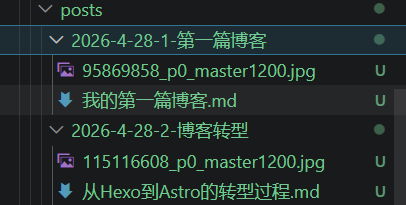

今天的文章依然是有关博客的，这些天经历了一次博客转型，从Hexo到Astro，这篇文章是为了记录一下转型的过程，也为想用 **Fuwari** 这个博客模板的人提供参考。

## 起因
在逛[hexo的主题商店](https://hexo.io/themes/)时，发现有了一个好看的主题模板——[Fuwari](https://github.com/saicaca/fuwari)，点进github主页却发现这个主题是基于Astro架构的，我问过gemini发现这个架构更复杂，比起Hexo更能够自定义样式，且更加复杂，能够自己折腾，感觉很符合我专业的特点，所以决定尝试。
> ps：为什么在Hexo的主题商店会有Astro架构的主题啊喂...

---

## 经过
### 1.环境的搭建
1.安装`pnpm`(Node.js包管理工具)
在终端执行`npm install -g pnpm`
执行`pnpm -v`查看版本

### 2.初始化项目
#### 1.直接用git clone 获取项目源码
在**非系统盘**下打开终端，执行
`git clone https://github.com/saicaca/fuwari.git Blog`，把源码直接拉到本地Blog文件夹下。

#### 2.安装依赖
进入Blog文件夹下，打开终端，执行`pnpm install --no-frozen-lockfile`[^1]来安装适合你环境的依赖。

随后执行`pnpm add sharp`安装图像库。

### 3.配置项目
#### 1.运行项目
打开文件夹（我用的是VSCode），在终端执行`pnpm dev`来运行项目。运行后在浏览器打开
`http://localhost:4321/` 就可以看到博客了。

#### 2.配置项目
在项目中找到`src/config.ts`，根据作者的配置来自定义项目。

### 4.在GitHub建仓
可以参看我[上一篇文章](https://vio1etz7.github.io/posts/2026-4-28-1-first-blog/my-first-blog/)的建仓方法

### 5.修改本地代码“连接指向”
因为你拉取到本地的项目还连着原作者的仓库，这里需要修改本地项目的指向。
在终端依次执行以下命令
```
1. 查看当前的远程连接（你会看到指向 saicaca/fuwari）
git remote -v

2. 删除原有的连接
git remote remove origin

3. 添加你自己的仓库连接（记得把下面的 Vio1etz7 换成你的 GitHub 用户名）
git remote add origin https://github.com/Vio1etz7/Vio1etz7.github.io.git

4. 再次验证（现在应该指向你自己的仓库了）
git remote -v
```
### 6.创建部署脚本
这一步是**gemini**给我的部署脚本代码
在项目中，找到`.github/workflow`,在里面新建文件 `deploy.yml`,把以下代码原样复制进去（这是业界通用的 Astro 部署脚本）：
```
name: Deploy to GitHub Pages

on:
  push:
    branches: [main] # 只要你向 main 分支推送代码，就会触发自动部署

permissions:
  contents: read
  pages: write
  id-token: write

jobs:
  build:
    runs-on: ubuntu-latest
    steps:
      - name: Checkout
        uses: actions/checkout@v4

      - name: Install pnpm
        uses: pnpm/action-setup@v3
        with:
          version: 9 # 强制 Actions 使用 pnpm 9 以匹配 Fuwari 的要求

      - name: Setup Node
        uses: actions/setup-node@v4
        with:
          node-version: 20
          cache: 'pnpm'

      - name: Install dependencies
        run: pnpm install --no-frozen-lockfile

      - name: Build Astro
        run: pnpm build

      - name: Upload artifact
        uses: actions/upload-pages-artifact@v3
        with:
          path: ./dist # Astro 默认构建输出目录

  deploy:
    needs: build
    runs-on: ubuntu-latest
    environment:
      name: github-pages
      url: ${{ steps.deployment.outputs.page_url }}
    steps:
      - name: Deploy to GitHub Pages
        id: deployment
        uses: actions/deploy-pages@v4
```

### 7.提交代码到GitHub并设置
#### 1.在终端依次执行
```
git add .
git commit -m "feat: 初始化博客"
git push -u origin main --force
```

#### 2.在GitHub上设置
打开你的仓库页面 -> Settings -> Pages。

在 Build and deployment 下方的 Source 选项中，选择 GitHub Actions。

### 8.修改语法问题
在开启GitHub Actions之后，可能会出现如下错误：
`code quality check failed`
原因是项目源代码中的返回值问题，我们在`src/utils/content-utils.ts`文件中找到 getSortedPostsList() 方法，修改为如下：
```
export async function getSortedPostsList(): Promise<PostForList[]> {
	const sortedFullPosts = await getRawSortedPosts();

	// delete post.body
	const sortedPostsList = sortedFullPosts.map((post) => ({
		slug: post.slug,
		data: {
			...post.data,
			category: post.data.category === null ? undefined : post.data.category,
		},
	}));

	return sortedPostsList as unknown as PostForList[];
}
```
### 9.有关文章的创建
可以在终端执行`pnpm new-post <filename>`来创建文章
也可以直接在`src/content/posts`目录下创建".md"文件，或者创建一个文件夹，把文章相关的资料都放在里面建议命名规范为`year-month-date-number-<filename>`以便于管理


### 遇到的坑

#### 1.pnpm install 过程
在用`npm`安装`pnpm`的过程中，由于`npm install -g pnpm`这个命令是直接安装最新版的`pnpm`且我的`node.js`也是v24版本，但是 **Fuwari** 要求`Node.js <= 22 pnpm <= 9`，所以安装依赖的时候出现了报错，这时可以用`pnpm install --no-frozen-lockfile`这个命令来安装适合你环境的依赖，就不用折腾环境的问题了。

#### 2.项目图片配置
在配置图片时有点小坑，因为作者是用英文写的文档和注释，一开始我没有理解，把图片放在`public\favicon`文件夹下时，引用路径开头要加 **“/”** ，放在`src/assets/images`文件夹下时不用在开头加  **“/”**。
**注意**：如果直接左键图片复制相对路径的话要把路径中的 **“\”**   换成   **“/”**

##### 3. 数据迁移与 YAML 语法问题
在搬运原有的 Hexo 博文时，我遇到了第一个报错：`YAMLException: can not read a block mapping entry`。
YAML 语法极其严谨。冒号 `:` 后面必须跟着一个 **半角空格**。
将 `description:内容` 修复为 `description: 内容`。

#### 4. 代码洁癖：Biome 格式化
为了保持代码整洁，流水线里开启了 Biome 检查。
我在修改了本地代码后，因为一些原因导致格式的错误，导致流水线检查失败。
修复：本地运行 `pnpm biome format --write ./src`，在代码提交前完成自动对齐和修复，确保了远程 CI 流程能够“绿灯通过”。

---


## 总结
如果你也想追求更现代的开发体验和更精美和可自定义的博客项目，Astro + Fuwari值得一试.

---
**下期预告**：我打算给博客集成 **Giscus** 评论系统，，敬请期待！

[^1]`pnpm install --no-frozen-lockfile`的作用
在`Node.js` 项目中，通常有一个`pnpm-lock.yaml`文件。它记录了项目作者在开发时，所有依赖包的精确版本和结构。类似 **Vue3** 中的`package.json`

默认行为 (frozen-lockfile)：`pnpm` 会严格按照这个文件去安装。如果你的 `pnpm` 版本或 `Node` 版本和作者的不一致，它发现“对不上”，就会报错拒绝安装，以保证环境绝对一致。

`-no-frozen-lockfile`：由于我用了最新的 `pnpm v10`，而项目是基于 `v9` 写的，文件变了。这个参数的意思是：“别管那份旧文件了，根据我现在的环境重新计算一份最合适的依赖关系，并生成新的配置文件。”
