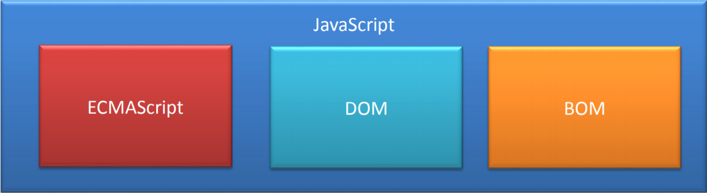
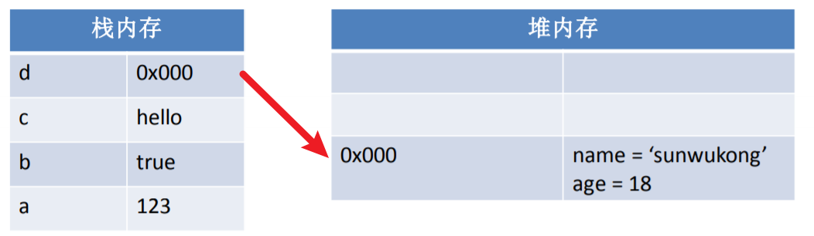

>  **写在前面**
> 
> 一点点背景介绍：从上次假期参赛以来，我对前端框架的接触越来越多，前后接触了 Vue、React、Astro，但是要说真正自己手写的代码也没有多少。你知道的，现在的大学生很多都是“面向大模型编程”。现在我也在负责我们项目的前端，所以打算开始系统地了解和学习 JavaScript，希望不算晚。
> 
> **版权声明**：以下部分内容摘自 CSDN博文 [《学习JavaScript这一篇就够了》](https://blog.csdn.net/qq_38490457/article/details/109257751?ops_request_misc=elastic_search_misc&request_id=3d78e3dcf461de1cea89a17f8a494502&biz_id=0&utm_medium=distribute.pc_search_result.none-task-blog-2~all~top_positive~default-1-109257751-null-null.142^v102^pc_search_result_base4&utm_term=javascript&spm=1018.2226.3001.4449)。由于是自己的学习记录，内容会有些零散，见谅...

📅 **记录时间：2026-05-24**

我是一个愿意了解历史和概念的人，所以首先到来的是 **JavaScript 的历史发展**。

---

## 1. JavaScript 简介

### 1.1 起源与发展 
JavaScript 诞生于 1995 年，它的出现主要是用于处理网页中的**前端验证**。所谓的前端验证，就是指检查用户输入的内容是否符合一定的规则（比如：用户名的长度、密码的长度、邮箱的格式等）。

> **为什么需要前端验证？**
> 在 1995 年那个年代，网速是非常慢的。如果全部依赖后端验证，向服务器发送请求后需要很久才能得到响应，这无疑是一种非常糟糕的用户体验。

为了解决这个问题，当时的浏览器巨头 **NetScape（网景）** 公司开发出了一种脚本语言，起初命名为 `LiveScript`。后来由于 SUN 公司的介入，更名为了 `JavaScript`。
*(注：Java 和 JavaScript 其实没啥关系，仅仅是为了蹭当年 Java 的热度，就像雷锋和雷峰塔的关系一样。)*

**世纪大战：网景 vs 微软**
- **1996年**：微软在其最新的 IE3 浏览器中引入了自己对 JavaScript 的实现 —— `JScript`。市面上同时存在了两个版本的 JS。
- **结局**：网景虽然是当时的巨头，但浏览器收费；而微软凭借 Windows 操作系统免费捆绑 IE 浏览器，最终干倒了网景（1998年网景被 AOL 收购）。

**标准的诞生：ECMAScript**
为了抢先获得规则制定权，网景最先将 JavaScript 作为草案提交给欧洲计算机制造商协会（**ECMA** 组织）。经过多方（网景、SUN、微软等）的磋商和博弈，最终发布了 **ECMA-262** 标准，定义了这门全新的脚本语言—— **ECMAScript**。

### 1.2 JavaScript 的组成 
我们已经知道ECMAScript是JavaScript标准，所以一般情况下这两个词我们认为是一个意思。但是实际上JavaScript的含义却要更大一些。
一个完整的 JavaScript 实现应该由以下三个部分构成：
*(ECMAScript 核心语法、DOM 文档对象模型、BOM 浏览器对象模型)*



### 1.3 核心特点 
-  **解释型语言**：不需要被编译为机器码再执行，而是直接执行。虽然少了编译步骤让开发更轻松，但早期运行较慢。现在由于使用了 JIT（即时编译）技术，运行速度得到了极大改善。
-  **动态语言**：变量的类型是不确定的。比如一个变量这一刻是整型，下一刻可能就会被赋值为字符串。
- **类似 C/Java 的语法结构**：`for`、`if`、`while` 等控制语句与 Java 基本一模一样，有 C/Java 基础的同学学起来会很轻松。
-  **基于原型的面向对象**：与 Java 的基于类（Class）不同，JS 是一门基于原型的面向对象语言。
-  **严格区分大小写**：`abc` 和 `Abc` 会被解析器认为是两个完全不同的变量。

---

## 2. JavaScript 基础语法 
*(注：这部分我会挑选一些我觉得值得记录的核心内容)*

### 2.1 比较运算符（== vs ===） 
之前大模型生成代码时常会用到 `===` 而不是我认为的 `==`，接下来便是解答：

比较运算符用来比较两个值是否相等，如果相等返回 `true`，否则返回 `false`。

*   **`==`（相等）**
    当比较两个值时，如果值的**类型不同**，则会**自动进行类型转换**，将其转换为相同的类型，然后再比较。
*   **`!=`（不相等）**
    判断两个值是否不相等。它也**会做自动的类型转换**，如果转换后相等，它会返回 `false`。
*   **`===`（全等）**
    判断两个值是否完全相等。它和 `==` 类似，不同的是它**不会做自动类型转换**。如果两个值的类型不同，直接返回 `false`。
*   **`!==`（不全等）**
    判断两个值是否不全等。同样**不会做自动类型转换**，如果两个值的类型不同，直接返回 `true`。

> ** 最佳实践**：在日常开发中，为了避免意想不到的类型隐式转换导致的 Bug，强烈建议默认使用 `===` 和 `!==`。

### 2.2 跳转逻辑（Label 标签） 
如果我们想要**跳出多层嵌套循环**或者跳到指定位置该怎么办呢？可以为循环语句创建一个 `label`，来标识当前的循环：

```js wrap
outer: for (var i = 0; i < 10; i++) {
    for (var j = 0; j < 10; j++) {
        if (j == 5) {
            // 直接跳出外层名为 outer 的循环
            break outer; 
        }
        console.log(j);
    }
}
```

### 2.3 深入理解对象 (Object) 📦
#### 2.3.1 创建对象
```js wrap
// 方式一：使用 new 关键字
var person = new Object();
person.name = '张三';
person.age = 18;

// 方式二：字面量方式（更常用推荐）
var person = {
    name: '张三',
    age: 18
};
```

#### 2.3.2 访问与删除属性
```js wrap
// 访问属性的两种方式
console.log(person.name);      // 点语法
console.log(person['name']);   // 中括号语法（适用于属性名是变量或包含特殊字符时）

// 删除对象属性
delete person.name;
```

#### 2.3.3 遍历对象属性
使用 for...in 循环遍历对象：

```js wrap
for (var personKey in person) {
    var personValue = person[personKey];
    console.log(personKey + " : " + personValue);
}
```

### 2.4 数据类型与内存机制 
#### 2.4.1 基本数据类型 vs 引用数据类型
JavaScript 中的变量包含两种不同数据类型的值：

基本数据类型（Primitive）：

一共有 5 种：String、Number、Boolean、Undefined、Null。（注：ES6+ 新增了 Symbol 和 BigInt）

基本数据类型的值是不可变的。

比较时是值的比较，只要值相等就认为变量相等。

引用数据类型（Reference）：

主要是对象（Object）、数组（Array）、函数（Function）等。

变量中保存的并不是对象本身，而是对象的引用（内存地址）。

从一个变量向另一个变量复制引用类型的值时，复制的是地址，两个变量指向同一个对象。改变其中一个会影响另一个。

#### 2.4.2 栈内存 (Stack) 与堆内存 (Heap)
JavaScript 在运行时，数据是保存到栈内存和堆内存当中的：

栈内存：用来保存变量和基本数据类型。（特点：先进后出，后进先出）

堆内存：用来保存对象（引用数据类型）。

当你声明一个变量时，实际上就是在栈内存中创建了一个空间用来保存变量。如果是引用类型，对象本体保存在堆内存中，而栈内存的变量里保存的是该对象在堆内存中的地址。

示例代码：

```js wrap
var a = 123;
var b = true;
var c = "hello";
var d = { name: 'sunwukong', age: 18 };
```
对应的内存结构示意图：


持续更新中... ☕