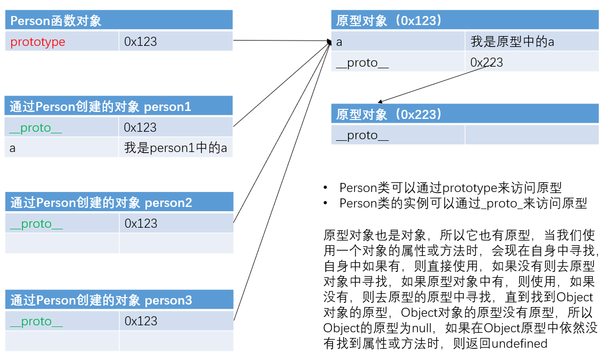

>  **写在前面**
> 
> 一点点背景介绍：从上次假期参赛以来，我对前端框架的接触越来越多，前后接触了 Vue、React、Astro，但是要说真正自己手写的代码也没有多少。你知道的，现在的大学生很多都是“面向大模型编程”。现在我也在负责我们项目的前端，所以打算开始系统地了解和学习 JavaScript，希望不算晚。
> 
> **版权声明**：以下部分内容摘自 CSDN博文 [《学习JavaScript这一篇就够了》](https://blog.csdn.net/qq_38490457/article/details/109257751?ops_request_misc=elastic_search_misc&request_id=3d78e3dcf461de1cea89a17f8a494502&biz_id=0&utm_medium=distribute.pc_search_result.none-task-blog-2~all~top_positive~default-1-109257751-null-null.142^v102^pc_search_result_base4&utm_term=javascript&spm=1018.2226.3001.4449)。由于是自己的学习记录，内容会有些零散，见谅...

📅 **记录时间：2026-05-24**

我是一个愿意了解历史和概念的人，所以首先到来的是 **JavaScript 的历史发展**。

---

## 1. JavaScript 简介

### 1.1 起源与发展 
JavaScript 诞生于 1995 年，它的出现主要是用于处理网页中的**前端验证**。所谓的前端验证，就是指检查用户输入的内容是否符合一定的规则（比如：用户名的长度、密码的长度、邮箱的格式等）。

> **为什么需要前端验证？**
> 在 1995 年那个年代，网速是非常慢的。如果全部依赖后端验证，向服务器发送请求后需要很久才能得到响应，这无疑是一种非常糟糕的用户体验。

为了解决这个问题，当时的浏览器巨头 **NetScape（网景）** 公司开发出了一种脚本语言，起初命名为 `LiveScript`。后来由于 SUN 公司的介入，更名为了 `JavaScript`。
*(注：Java 和 JavaScript 其实没啥关系，仅仅是为了蹭当年 Java 的热度，就像雷锋和雷峰塔的关系一样。)*

**世纪大战：网景 vs 微软**
- **1996年**：微软在其最新的 IE3 浏览器中引入了自己对 JavaScript 的实现 —— `JScript`。市面上同时存在了两个版本的 JS。
- **结局**：网景虽然是当时的巨头，但浏览器收费；而微软凭借 Windows 操作系统免费捆绑 IE 浏览器，最终干倒了网景（1998年网景被 AOL 收购）。

**标准的诞生：ECMAScript**
为了抢先获得规则制定权，网景最先将 JavaScript 作为草案提交给欧洲计算机制造商协会（**ECMA** 组织）。经过多方（网景、SUN、微软等）的磋商和博弈，最终发布了 **ECMA-262** 标准，定义了这门全新的脚本语言—— **ECMAScript**。

### 1.2 JavaScript 的组成 
我们已经知道ECMAScript是JavaScript标准，所以一般情况下这两个词我们认为是一个意思。但是实际上JavaScript的含义却要更大一些。
一个完整的 JavaScript 实现应该由以下三个部分构成：
*(ECMAScript 核心语法、DOM 文档对象模型、BOM 浏览器对象模型)*


### 1.3 核心特点 
-  **解释型语言**：不需要被编译为机器码再执行，而是直接执行。虽然少了编译步骤让开发更轻松，但早期运行较慢。现在由于使用了 JIT（即时编译）技术，运行速度得到了极大改善。
-  **动态语言**：变量的类型是不确定的。比如一个变量这一刻是整型，下一刻可能就会被赋值为字符串。
- **类似 C/Java 的语法结构**：`for`、`if`、`while` 等控制语句与 Java 基本一模一样，有 C/Java 基础的同学学起来会很轻松。
-  **基于原型的面向对象**：与 Java 的基于类（Class）不同，JS 是一门基于原型的面向对象语言。
-  **严格区分大小写**：`abc` 和 `Abc` 会被解析器认为是两个完全不同的变量。

---

## 2. JavaScript 基础语法 
*(注：这部分我会挑选一些我觉得值得记录的核心内容)*

### 2.1 比较运算符（== vs ===） 
之前大模型生成代码时常会用到 `===` 而不是我认为的 `==`，接下来便是解答：

比较运算符用来比较两个值是否相等，如果相等返回 `true`，否则返回 `false`。

*   **`==`（相等）**
    当比较两个值时，如果值的**类型不同**，则会**自动进行类型转换**，将其转换为相同的类型，然后再比较。
*   **`!=`（不相等）**
    判断两个值是否不相等。它也**会做自动的类型转换**，如果转换后相等，它会返回 `false`。
*   **`===`（全等）**
    判断两个值是否完全相等。它和 `==` 类似，不同的是它**不会做自动类型转换**。如果两个值的类型不同，直接返回 `false`。
*   **`!==`（不全等）**
    判断两个值是否不全等。同样**不会做自动类型转换**，如果两个值的类型不同，直接返回 `true`。

> ** 最佳实践**：在日常开发中，为了避免意想不到的类型隐式转换导致的 Bug，强烈建议默认使用 `===` 和 `!==`。

### 2.2 跳转逻辑（Label 标签） 
如果我们想要**跳出多层嵌套循环**或者跳到指定位置该怎么办呢？可以为循环语句创建一个 `label`，来标识当前的循环：

```js wrap
outer: for (var i = 0; i < 10; i++) {
    for (var j = 0; j < 10; j++) {
        if (j == 5) {
            // 直接跳出外层名为 outer 的循环
            break outer; 
        }
        console.log(j);
    }
}
```

### 2.3 深入理解对象 (Object) 📦
#### 2.3.1 创建对象
```js wrap
// 方式一：使用 new 关键字
var person = new Object();
person.name = '张三';
person.age = 18;

// 方式二：字面量方式（更常用推荐）
var person = {
    name: '张三',
    age: 18
};
```

#### 2.3.2 访问与删除属性
```js wrap
// 访问属性的两种方式
console.log(person.name);      // 点语法
console.log(person['name']);   // 中括号语法（适用于属性名是变量或包含特殊字符时）

// 删除对象属性
delete person.name;
```

#### 2.3.3 遍历对象属性
使用 for...in 循环遍历对象：

```js wrap
for (var personKey in person) {
    var personValue = person[personKey];
    console.log(personKey + " : " + personValue);
}
```

### 2.4 数据类型与内存机制 
#### 2.4.1 基本数据类型 vs 引用数据类型
JavaScript 中的变量包含两种不同数据类型的值：

基本数据类型（Primitive）：

一共有 5 种：String、Number、Boolean、Undefined、Null。（注：ES6+ 新增了 Symbol 和 BigInt）

基本数据类型的值是不可变的。

比较时是值的比较，只要值相等就认为变量相等。

引用数据类型（Reference）：

主要是对象（Object）、数组（Array）、函数（Function）等。

变量中保存的并不是对象本身，而是对象的引用（内存地址）。

从一个变量向另一个变量复制引用类型的值时，复制的是地址，两个变量指向同一个对象。改变其中一个会影响另一个。

#### 2.4.2 栈内存 (Stack) 与堆内存 (Heap)
JavaScript 在运行时，数据是保存到栈内存和堆内存当中的：

栈内存：用来保存变量和基本数据类型。（特点：先进后出，后进先出）

堆内存：用来保存对象（引用数据类型）。

当你声明一个变量时，实际上就是在栈内存中创建了一个空间用来保存变量。如果是引用类型，对象本体保存在堆内存中，而栈内存的变量里保存的是该对象在堆内存中的地址。

示例代码：

```js wrap
var a = 123;
var b = true;
var c = "hello";
var d = { name: 'sunwukong', age: 18 };
```
对应的内存结构示意图：


📅 **记录时间：2026-05-27**
### 2.5 函数
#### 2.5.1 函数声明 
函数声明方法：
- 函数对象（几乎不用）
```js wrap
var 函数名 = new Function（"执行语句"）  

//eg
var fun = new Function("console.log('hello world!');")
```
- 函数声明（常用）
```js wrap 
function 函数名(参数列表) {}

//eg
function fun(){
    console.log("hello world!");
}

```

- 函数表达式（常用）
```js wrap 
var 函数名 = function(参数列表) {  }

//eg
var fun = function(){
    console.log("hello world!");
}
```
#### 2.5.2函数参数
- 调用函数时，解析器不会检查实参的类型，所以要注意，是否有可能会接收到非法的参数，如果有可能，则需要对参数进行类型的检查，函数的实参可以是任意的数据类型
- 调用函数时，解析器也不会检查实参的数量，多余实参不会被赋值，如果实参的数量少于形参的数量，则没有对应实参的形参将是undefined


#### 2.5.3 立即执行函数
立即执行函数：函数定义完，立即被调用，这种函数叫做立即执行函数，立即执行函数往往只会执行一次。
eg：
```js wrap
(function (){
    console.log("我是立即执行函数");

})();
```

#### 2.5.4 this对象
解析器在调用函数每次都会向函数内部传递进一个隐含的参数，这个隐含的参数就是this，this指向的是一个对象，这个对象我们称为函数执行的上下文对象，根据函数的调用方式的不同，this会指向不同的对象

以函数的形式调用时，**this永远都是window**
以方法的形式调用时，**this就是调用方法的那个对象**
eg:
```js wrap
var name = "全局变量name";

function fun(){
    console.log(this.name);
}

var obj = {
    name: "zhangsan";
    sayName: fun;
}

//我们希望调用boj.sayName()输出的是obj.name，而不是全局变量name
obj.sayName();

```
### 2.6 用构造函数对象
构造函数（可以类比C++）：
构造函数：构造函数就是一个普通的函数，创建方式和普通函数没有区别，不同的是构造函数习惯上首字母大写，构造函数和普通函数的还有一个区别就是调用方式的不同，普通函数是直接调用，而构造函数需要使用new关键字来调用。
```js wrap
// 使用构造函数来创建对象
function Person(name, age) {
    // 设置对象的属性
    this.name = name;
    this.age = age;
    // 设置对象的方法
    this.sayName = function () {
        console.log(this.name);
    };
}

var person1 = new Person("孙悟空", 18);
var person2 = new Person("猪八戒", 19);
var person3 = new Person("沙和尚", 20);

console.log(person1);
console.log(person2);
console.log(person3);

```

那构造函数是怎么执行创建对象的过程呢？我再来解释一下：

1.调用构造函数，它会立刻创建一个新的对象
2.将新建的对象设置为函数中this，在构造函数中可以使用this来引用新建的对象
3.逐行执行函数中的代码
4.将新建的对象作为返回值返回

利用构造函数创建的对象称为一类对象，也将一个构造函数称为一个类。我们将通过一个构造函数创建的对象，称为是该类的实例。
现在，this又出现了一种新的情况，为了不混淆，再来梳理一下：

当以函数的形式调用时，this是window
当以方法的形式调用时，谁调用方法this就是谁
当以构造函数的形式调用时，this就是新创建的那个对象

我们可以用```instanceof```运算符检测一个对象是否是一个类的实例，它返回```true```或者```false```
eg:
```javascript
对象 instanceof 构造函数
```
### 2.7 原型
抽出对象中的方法作为全局函数不太好，因为会污染作用域，有没有一种方法，我只在Person这个类的全局对象中添加一个函数，然后在类中引用？答案肯定是有的，这就需要原型对象了，我们先看看怎么做的，然后在详细讲解原型对象。
```js wrap
// 使用构造函数来创建对象
function Person(name, age) {
    // 设置对象的属性
    this.name = name;
    this.age = age;
}

// 在Person类的原型对象中添加方法
Person.prototype.sayName = function() {
    console.log(this.name);
};

var person1 = new Person("孙悟空", 18);
var person2 = new Person("猪八戒", 19);
var person3 = new Person("沙和尚", 20);

person1.sayName();
person2.sayName();
person3.sayName();
```
原型（prototype）到底是什么呢？

我们所创建的每一个函数，解析器都会向函数中添加一个属性**prototype**，这个属性对应着一个对象，这个对象就是我们所谓的原型对象，即显式原型，原型对象就相当于一个公共的区域，所有同一个类的实例都可以访问到这个原型对象，我们可以将对象中共有的内容，统一设置到原型对象中。

如果函数作为普通函数调用prototype没有任何作用，当函数以构造函数的形式调用时，它所创建的对象中都会有一个隐含的属性，指向该构造函数的原型对象，我们可以通过__proto__（隐式原型）来访问该属性。当我们访问对象的一个属性或方法时，它会先在对象自身中寻找，如果有则直接使用，如果没有则会去原型对象中寻找，如果找到则直接使用。

以后我们创建构造函数时，可以将这些对象共有的属性和方法，统一添加到构造函数的原型对象中，这样不用分别为每一个对象添加，也不会影响到全局作用域，就可以使每个对象都具有这些属性和方法了


### 2.8 原型链
访问一个对象的属性时，先在自身属性中查找，找到返回， 如果没有，再沿着__proto__这条链向上查找，找到返回，如果最终没找到，返回undefined，这就是原型链，又称隐式原型链，它的作用就是查找对象的属性(方法)。

我们使用一张图来梳理一下上一节原型案例的代码：


> 注意：Object对象是所有对象的祖宗，Object的原型对象指向为null，也就是没有原型对象

### 2.9 hasOwnProperty方法
hasOwnProperty方法，用于判断对象自身属性中是否有该属性。
eg:
```js wrap
function Myclass(){}

Myclass.prototype.name = '我是原型中的名字';

var myclass = new Myclass();
myclass.age = 18;

//用in 关键字判断对象自身属性中是否有该属性
console.log('name' in myclass);
console.log('age' in myclass);
//输出结果都为true,因为name属性是继承的

console.log(myclass.hasOwnProperty('name'));
console.log(myclass.hasOwnProperty('age'))
//输出结果为false,true,因为name属性是继承的
```
>注: hasOwnProperty()方法是Object中的方法.

### 2.9 对象继承

前边我们一直在说继承，那什么是继承？它有什么作用？如何实现继承？将会是本章节探讨的问题。

面向对象的语言有一个标志，那就是它们都有类的概念，而通过类可以创建任意多个具有相同属性和方法的对象。但是在**JavaScript中没有类的概念**，前边我们说所的类只是我们自己这么叫，大家要清楚。因此它的对象也与基于类的对象有所不同。实际上，JavaScript语言是通过一种叫做原型（prototype）的方式来实现面向对象编程的。

那实现继承有一个最大的好处就是子对象可以使用父对象的属性和方法，从而简化了一些代码。

JavaScript有六种非常经典的对象继承方式，但是我们只学习前三种：

- **原型链继承**
- **借用构造函数继承**
- **组合继承（重要）**
- 原型式继承
- 寄生式继承
- 寄生组合式继承


---
持续更新中... ☕