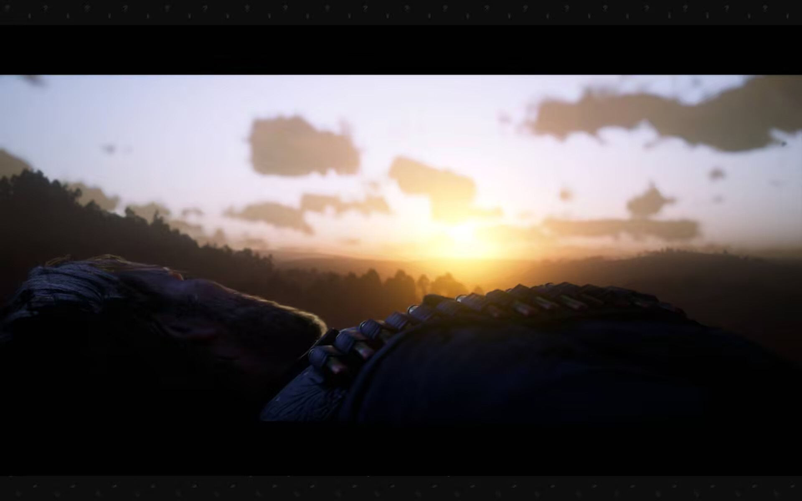
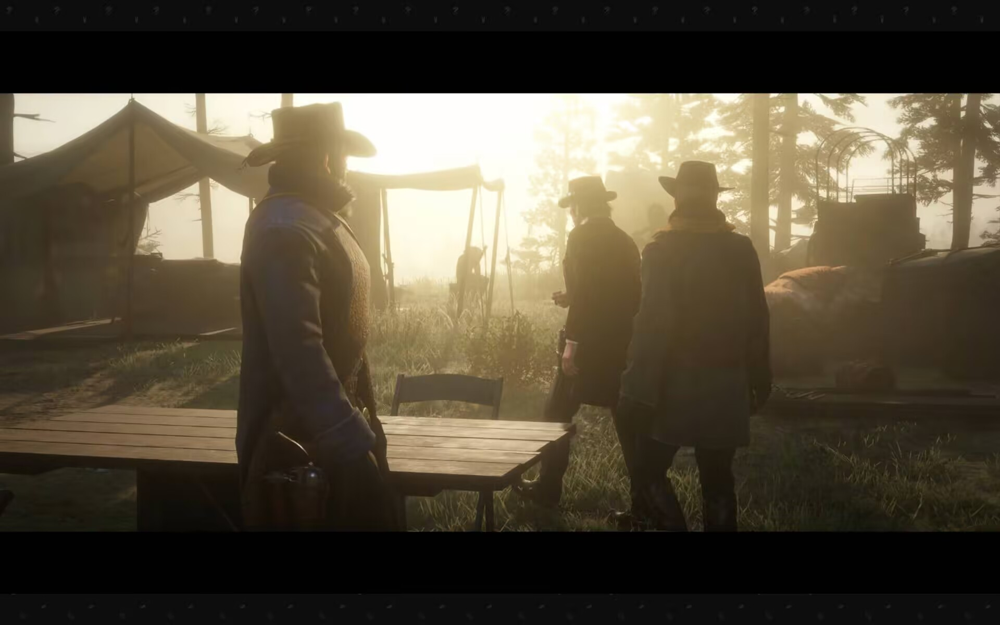
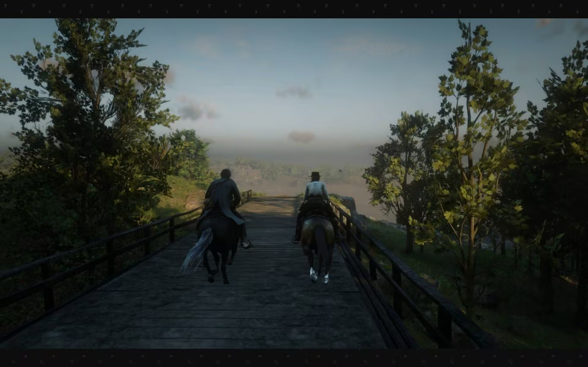
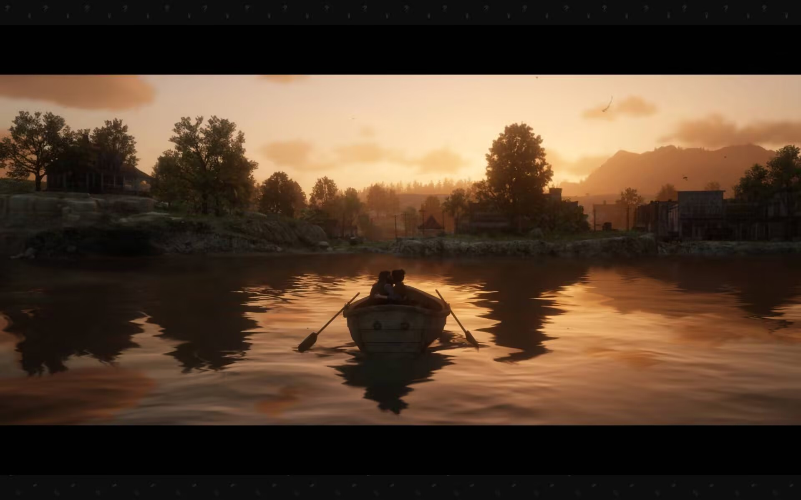
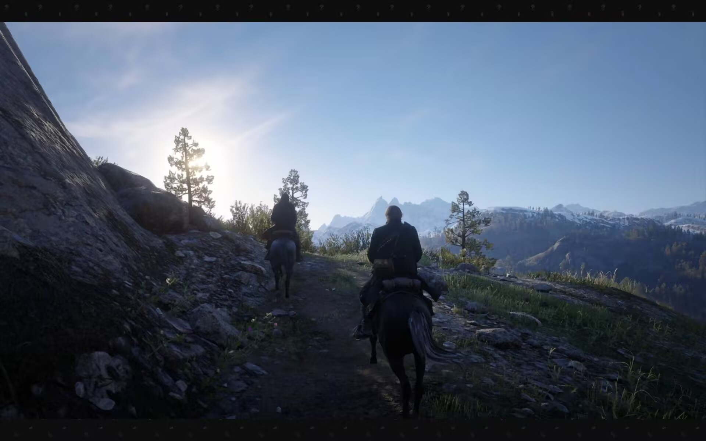
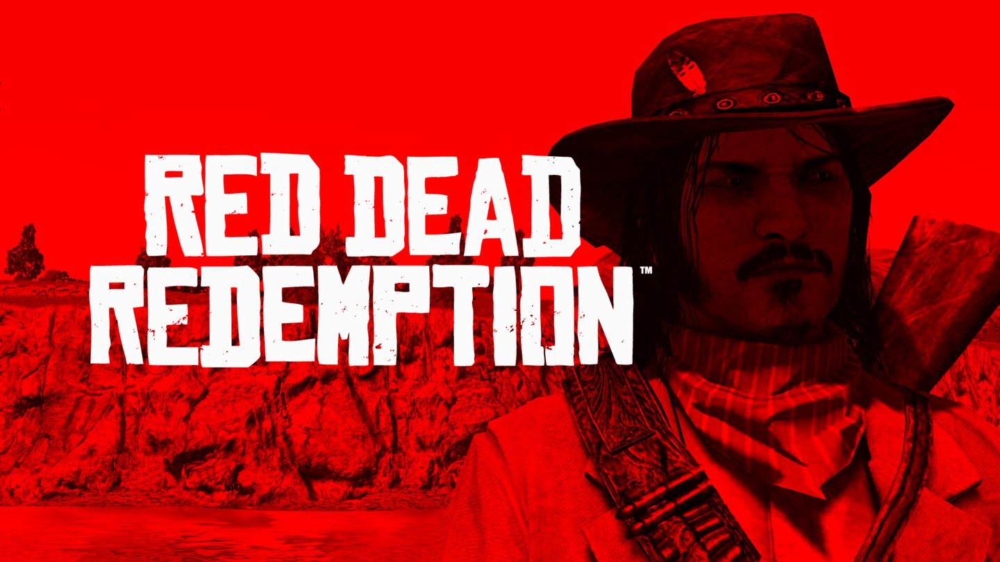
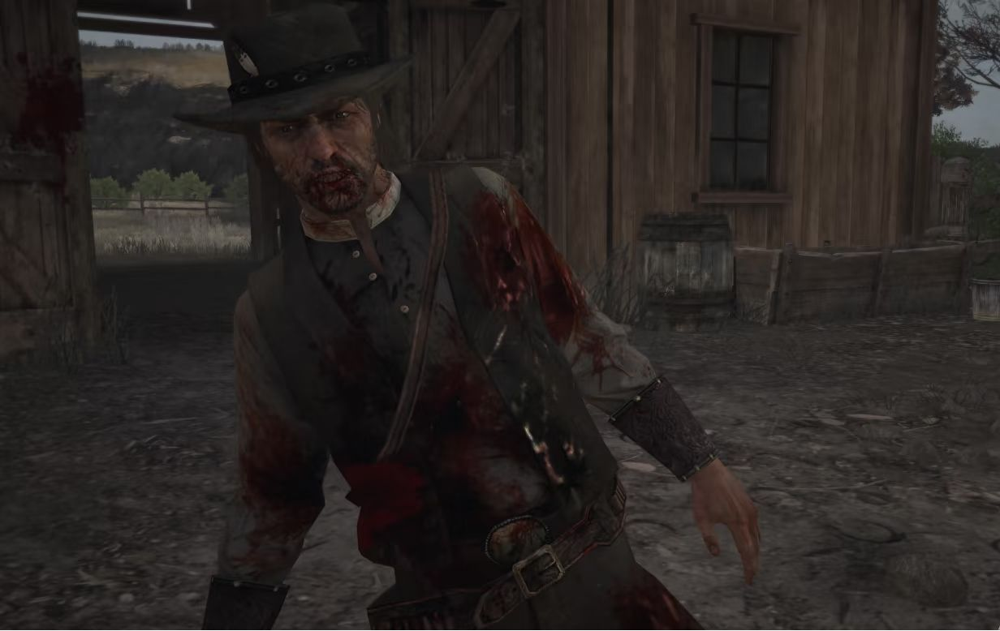

我现在耳机里正放着荒野大镖客2的原声专辑，Outlaws From The West，身上起了一层鸡皮疙瘩。写下这篇文章，只是我的有感而发，感觉通关了这样一个作品后应该留下点什么。

这是一个西部的故事，荒野，牛仔，酒馆，狂欢，抢劫，杀戮，枪战，当然还有温暖和救赎。亚瑟摩根，Arthur Morgan是范德林德帮的一个枪手，这是他的救赎之路。

---

## 人物

### Arthur Morgan
游戏开篇的亚瑟是一个没有感情，愚蠢但是忠诚、高效的枪手，还记得刚开始不管是达奇还是何西阿，甚至是帮派里的其他枪手都让亚瑟多动动脑子，不要问那么多显而易见的问题，虽然愚钝，但他在执行任务时从不含糊，干净利落行事干练。

不知道从什么时候开始，亚瑟开始思考，可能是患上肺结核的时候也可能更早，是知道自己时日无多还是看到了太多不值得的杀戮？他在一个个主线和支线任务中，和一个个个性鲜明但又截然不同的人产生交集的过程中产生了自己的思考，他和深爱的女人玛丽，帮派的兄弟查尔斯，和印第安酋长rainsfall的交互都在让他疑惑，让他思考，进而让他成长，他开始质疑首领达奇的想法，不再一味的盲从，他开始考虑帮派其他人的命运，让他们离开，最后更是为了让约翰活下去，自己倒在了朝阳之下。

你可以说这是一个土匪，一个强盗，一个混蛋，他最后的死是罪有应得，当然，这无可厚非，像亚瑟自己说的，他远远不是一个好人，但是他愿意思考，愿意改变，愿意帮助他人，他就值得自我的救赎。这个游戏的就是一个牛仔的救赎，是亚瑟的救赎。

---

### Dutch Van Der Linde
我想聊一聊达奇，这个人物也被塑造的很好，他很聪明，很狡猾，很擅长俘获人心，他知道怎么让帮派团结，怎么让人心服帖，它制定了规矩，立下了承诺，让牛仔们心甘情愿，死心塌地地追随他，甚至是牧师，厨子，放高利贷的，女人们也都在帮派里找到归宿，或许真的像亚瑟说的，达奇与其他人不同，他不像奥德里思科帮的首领，不像其他帮派的首领一样无情，把手下当棋子，他们像是一个大家庭，他们只做自己觉得对的事，他们觉得这只是一种生活方式，这都是达奇的功劳。

达奇也被戏称为西部点子王——
> I have a god damn plan!! 

他确实很有想法，他可能真的想让帮派的人过上好的生活，但是他的盲目，某些方面的愚蠢让帮派一次次地逃亡，始终没搞到那笔让帮派过上好日子的钱。可能在何西阿这个老朋友死去之后，他就变了，变的无情，变成了一个自私残忍，追求财富的土匪，他没有了之前的情谊，他一心搞钱，分辨不出狡黠迈卡的诡计，他自私的抛弃亚瑟，两次抛弃约翰，却虚伪地说那是当时最好的选择，妄图再次让这些牛仔们追随自己。

他是糊涂了吗？是被迈卡迷惑了吗？或许都不是，他一直在欺骗自己，他说服自己做的决定都是正确的，一切的失败都是因为自己被背叛了，他在妄想中让范德林德帮变的更好。最后的复仇之战中他在犹豫过后向迈卡开枪时，或许他才真正地接受了自己的愚蠢错误，虽然已经无济于事。

---

### Charles Smith
我一直想聊一聊查尔斯-史密斯这个角色，因为他是RDR2中除了亚瑟，我最喜欢的角色，故事中说过他有印第安人的血脉，他对自然和生命的敬畏或许也是源自自己的血脉，还记得一个任务中亚瑟和查尔斯一起去狩猎牦牛（或许是？或是另一种牛），他们看到了一地的牦牛尸体，但是没有取肉剥皮，这种为了杀戮的杀戮让查尔斯非常生气，他们一起找到了凶手并杀了他们。这个任务让我印象很深刻，这对查尔斯的人物形象更深刻了。

这种对生命的敬畏或许让查尔斯产生了更多的思考，他对事情一直有自己的看法，他好像是走在亚瑟前面的导师，引导亚瑟去看见，去思考，亦师亦友，对朋友忠诚，对事情明晰，理性而温柔，可能温柔谈不上，但他是平静的，对事对人都是。他也在最终决战后回到营地安葬了格雷姆肖恩女士和亚瑟。之后去圣丹尼斯打黑拳为生，后来被约翰和大叔找到和他们一起生活了一段时间，再到复仇迈卡后去追寻自己的生活。他说过要北上，找个女人在加拿大或是什么地方结婚，安家。这或许就是他的生存之道吧。

---

### Sadie Adler
聊一聊莎迪-阿德勒，她本是一个被奥德里思科帮杀害丈夫的妇女，被亚瑟救下后就跟随范德林德帮一起行动，刚开始我对她还没有什么映像，但好像是从那个到镇上采购的任务，她刚烈的性格才让我记得还有这么一号人物，在后面的任务和逃亡中，她像是帮派的女性领袖，每次都会站出来保护帮派免受伤害，可能是那天夜里丈夫被杀害的时候她就成了另外一个人，一个拥抱荒野但是重情重义，爱憎分明的人，她在帮助帮派逃亡，拯救约翰，拯救阿比盖尔的时候都是绝对的主力，也是向奥德里思科帮复仇，向迈卡复仇的带领者，不管是在亚瑟还是约翰的剧情里，她都是那个带头冲锋的人。

我不知道是什么能让一个失去丈夫的女性有这么强大的力量，她是真正强大的人。她在尾声部分一直作为一个赏金猎人在各地游荡，约翰多次邀请她和他们一起生活都被委婉拒绝，在复仇迈卡后，在约翰的农场里养伤参加婚礼之后又换上了皮衣和牛仔帽，踏上了荒野，或许她在丈夫死后就不会再有归宿了，她唯一的归宿是荒野，是一望无际的草原。

---

### John Marston
最后聊一聊约翰-马斯顿，作为亚瑟死后的尾声主角，约翰的人物在尾声的过程中也被升华了。在范德林德帮中，我对约翰始终没有什么印象甚至还把他和另一个哈维尔弄混，但是知道了阿比盖尔和他是夫妻之后我就能认准他了，但是还是对他没有什么印象。直到抢圣丹尼斯银行被抓，被达奇抛弃后我才对他有了倒霉蛋的印象，再到亚瑟劝说他离开帮派，和阿比盖尔和孩子逃走的时候，他说：
> what about loyalty？

时，我先是觉得他很蠢，但是又为他的忠诚感到尊敬，他也察觉到了达奇变的不对劲，但还是想着loyalty，这确实是牛仔的美德。

在尾声部分他为了妻儿到牧场从0做起了牧场工人，这让我感到他真的成长了，但是又不得不做一些老本行的事，这让阿比盖尔很是不满，和孩子离开了。约翰没有消沉，他为了妻儿去改变，去银行贷款，去订购木材和工具，去做一些自己不擅长的事，只为了给妻儿一个家，虽然还是很笨拙，但他在脚踏实地地前进。

从建房子到求婚，约翰过上了幸福的生活，但还差一步--复仇。这也是很难忘的任务，在登上雪山之前，他特意换上了亚瑟的牛仔帽，这让我实在感动，这就是亚瑟救赎的体现吧。在American Venom的评论区里看见这样一句话：
> 复仇是蠢人的行为，但是我约翰-马斯顿从来都不是聪明人。

在故事结束后的制作人滚动条画面中，有一条暗线是平克顿侦探还是追查范德林德帮的残党，但在看到约翰的农场后，两个侦探扭头就走了，我不知道这是什么意思，或许是去报告情况了，又或许是看到了约翰改过自新后便放弃了追查，我更希望是后者。

---

## 剧情
接下来我想聊一聊相关剧情，首先就是eaglefly和rainfall的印第安部落的故事，这或许是美国的作品，又是西部牛仔的故事绕不开的话题，美国为了开采石油强行征用原著民的土地，rainfall作为酋长，多次和上校谈判讲和，但政府多次无视条款，对原住民进行迫害，他就代表了那个鸽派，他的儿子代表了那个鹰派，他血气方刚，被达奇利用带领印第安年轻人们一次又一次地对政府发起反抗，结果显而易见，政府给这些反抗的行为加上了叛国的罪名，eaglefly战死在了反抗的起义中。这种事情好像就是无解的，讲和是表面，实际还是会被侵犯权益，被一点点蚕食；反抗更是为政府的侵犯行为正当化，加快了印第安人的灭亡。资本的万恶，国家对原住民的视而不见，这无疑是悲惨的，但却又那么无奈。。rainfall是一个智者，他希望谈和，却在一次又一次的谈和中清楚地认识到，这不过是徒劳，绝望又窒息。

在游戏中还有一个让我难以忘记的支线任务--一次亚瑟在路边救下了一个老兵，他的义肢被他的马带走了，他只能靠在岩石上求助，亚瑟帮他找回了马和义肢从而让他们结下了友谊，之后亚瑟找他钓过鱼，打过猎，在这个任务中我还解锁了那个钓大鱼的成就，他们一起狩猎了灰狼，却在最后一次狩猎一头野猪的时候死去，我还记得那个任务名叫伟大的狩猎，取得的是野猪的獠牙作为战利品。为什么我对这个支线印象很深呢，可能是因为那是亚瑟确证肺结核，又处在帮派纷乱繁杂时候唯一的轻松时刻了吧，老兵和亚瑟的友谊很纯粹，让人感慨。最后时刻老兵把他的马托付给了亚瑟，我把他存在马厩好好保存了。

---

## 尾声
我当然要去玩前一作，但是我要期末考了 noooooooooo！！

---

## 续 --荒野大镖客：救赎
正如我所说的，现在我已经通关了荒野大镖客：救赎，现在是2026.7.30凌晨0：14，我现在耳机里播放的是荒野大镖客：救赎原声带，我不知道怀着什么样的心情写下这些文字。

## 剧情
接上一部的结尾，平克顿侦探还是找到了约翰，剧情还是朝着我不希望的方向发展了，为了追捕范德林德帮的残党，以自己的妻子和孩子作为要挟，约翰开始为美国政府做事，（一个有趣的细节：游戏的第一章叫政府小子），他先后追捕了比尔，哈维尔最后是达奇，拿他们的人头“换回”了自己的妻儿和生活。但是好景不长，平克顿侦探仍没打算放过约翰，在约翰回归家庭回归牧场生活没几天，军队和侦探还是打了过来，他们不由分说，像是随意地抛弃了一个无用的棋子。他们先杀了大叔再把约翰打成了筛子。留下约翰的妻儿独自生活，生活是无常的，阿比盖尔也在三年后去世，独留杰克。在最后的剧情中，杰克-马斯顿找到了罗斯探员，报仇雪恨。

约翰-马斯顿的平静生活是亚瑟用生命换来的，但是这没有持续多久，侦探用妻儿作为威胁，强迫约翰重操旧业，不过这次代表的是美国政府。约翰踏遍南部，之后追到了墨西哥，甚至深度参与了墨西哥的内乱，只为了揪出那两个被墨西哥政府私藏的凶恶罪犯。解决了旧帮派的兄弟后，轮到了首领达奇，他在黑水镇附近集结了被美国政府驱逐的印第安原住民（不得不佩服达奇的领导力），盘踞在雪山上。达奇的本质毫无疑问的就是亡命徒，在这一作中的表现彻底打消了我对达奇的幻想，他的诺言全是虚假的，只是为了蛊惑人心罢了。约翰在这趟旅途中心里只有一个念头--和家人团聚，在墨西哥内乱的剧情中他分别多次为墨西哥军队和叛军做事，别人劝他保持立场的时候，他说他不站在任何一边，他只想要两个人头。我在想为什么这个游戏叫荒野大镖客：救赎，2是亚瑟对自己的救赎，那这一作呢？直到我在网易云上读到了下面这段评论：

> 你也一定厌倦了永无休止的决斗，追杀，复仇和革命吧，
> 你也一定想和你所爱的人在金色夕阳下，广袤的荒野上狩猎，放牛，驯马，驾车吧。
> 但当你从拿起枪的那一刻起，你的命运就注定了，你将像个悍匪最终一样横尸荒野
> 但你坚定的走上这条救赎之路

约翰的这段旅程就是救赎，是对自己的救赎，对过去的救赎，是对妻子和孩子未来的救赎，虽然结局已经注定，或许他自己早已料到最后难逃一死，但是他还是选择踏上这段旅程，是为了妻儿，也是为了自己，救赎可能不是结果而是这一路的过程。

再来说一说在墨西哥的这段剧情，我觉得这段剧情是最值得反复品味和深挖的。具体是约翰到了墨西哥找当地政权诉说需求，而被当地政权要求协助镇压叛乱才能帮助约翰找人，但却最终被当地政府背叛，用完后就打算杀死约翰，私藏哈维尔和比尔的也是他们。但是在这过程种约翰也结识了叛军的首领，最后又被叛军所救，也是叛军协助他找到了他所搜寻的两个人。这其中有很多有趣的细节，例如两方势力的手下对各自的首领都很尊敬，但实际看下来都不是什么好货色。政府这边首领好色，迫害平民女子，事务从不过问，都是由手下办理，压迫下属，但是手下却还不容约翰诋毁；叛军这边的首领也是好色，，但他是渣男行径，利用手下女性对他的信任和她们发生关系，对于一个深爱他的，已经被骗与之有婚约的女子，他甚至连她的名字都不曾记住，但这个女子以及其他叛军却对这位所谓的首领有宗教般的信仰。最后是叛军推翻了当地的统治，约翰就与他们告别了，这不禁让人联想，就算这个叛军领袖真的推翻了墨西哥当权的统治者，下一次革命也会马上揭竿而起吧。墨西哥人民的噩梦才刚刚开始。

最后是达奇和印第安人这边，这边的情况多少也是2中剧情的延续，从美国历史的角度来看也是，rainfall的和谈还是没有效果，也不可能有效果。部分印第安人被达奇利用成为了亡命徒，这部分也可以看出美国人民对印第安人歧视的端倪。

现在再来讨论约翰是否应该被杀已经没有意义了，他的死是注定的，就算没有罗斯探员也会有高斯探员来杀他，他的死是美国对西部时代的扼杀，是时代杀了他，他的死标志着一个时代的终结。值得品味的是制作组在最后安排了杰克的复仇剧情：在父母死后，杰克换上了父亲的装备，就像他所读过的书里那样，复仇方式也是经典的牛仔决斗，仿佛预示着杰克-马斯顿是这辽阔的西部最后一个牛仔。这也是RockStars的浪漫吧。

其实我已经通关两天了，但是拖到今天才来写这个续，是因为我在玩荒野大镖客：救赎时没有玩荒野大镖客：救赎2那样的震撼和感触了；但是现在写下这些话时我又觉得不愧是大镖客不愧是RockStars，真是一部好作品，一个好系列。