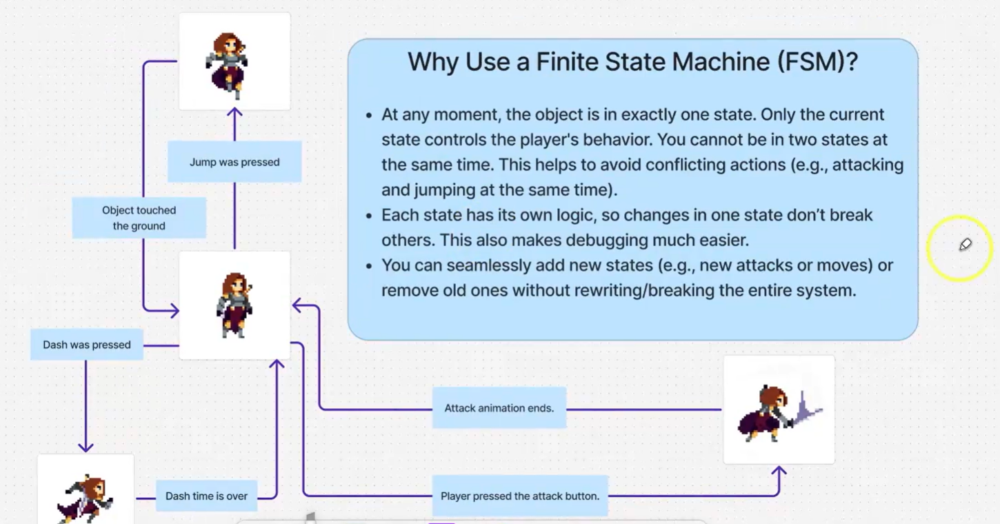

> 没想到鸽了这么久，暑假还是太放纵了，连前端 JS 的学习都没有继续……不过接下来要开始努力更新博客了！以下依然是我的学习记录，这篇主要总结了 Unity 游戏开发中的一些核心基础概念。

## 一、 有限状态机（Finite State Machine, FSM）

在游戏开发中，我们经常需要处理角色或物体的各种状态。**有限状态机（FSM）** 是最经典且常用的设计模式之一。

简单来说，有限状态机指的是一个系统拥有**有限个状态**，并且在同一时刻只能处于**其中一个状态**。
*   **举例 1（电视机）**：拥有 2 个状态 —— `On`（开） / `Off`（关）。
*   **举例 2（红绿灯）**：拥有 3 个状态 —— `Red`（红） / `Yellow`（黄） / `Green`（绿）。



### 有限状态机的代码实现

为了在 Unity 中实现 FSM，我们通常会将其拆分为几个核心类。

#### 1. 具体状态基类（EntityState）
所有状态的父类，用来初始化及存储一些公用的状态和生命周期方法。

```csharp title="EntityState.cs"
using UnityEngine;

//所有状态的父类
public abstract class EntityState 
{
    protected Player player;  //玩家类
    protected StateMachine stateMachine;
    protected string stateName;

    public EntityState(Player player,StateMachine stateMachine,string stateName)
    {
        this.player = player;
        this.stateMachine = stateMachine;
        this.stateName = stateName;
    }

    public virtual void Enter()
    {
        //每次切换状态时调用，用作初始化
        Debug.Log("I entered " + stateName);
    }

    public virtual void Update()
    {
        //每帧执行的逻辑
        Debug.Log("I run update of " + stateName);
    }

    public virtual void Exit()
    {
        //每次退出当前状态时调用
        Debug.Log("I exit " + stateName);
    }
}
```

#### 2. 状态机控制类（StateMachine）
用于保存当前状态，并处理状态的初始化与切换逻辑。

```csharp title="StateMachine.cs"
using UnityEngine;

//用作状态之间的切换
public class StateMachine 
{
    public EntityState currentState { get; private set; } //外部可访问不可修改

    public void Initialize(EntityState startState)
    {
        currentState = startState;
        currentState.Enter();
    }

    public void ChangeState(EntityState newState) 
    {
        currentState.Exit();
        currentState = newState;
        currentState.Enter();       
    }
    
    public void UpdateActiveState()
    {
        currentState.Update();
    }
}
```

#### 3. 具体状态实现示例（Player_IdleState）
默认的空闲状态，继承于 `EntityState`。状态类创建后，需要在玩家的主脚本（如 `Player.cs`）里实例化，并使用构造函数赋值。

```csharp title="Player_IdleState.cs"
using UnityEngine;

public class Player_IdleState : EntityState
{
    public Player_IdleState(Player player, StateMachine stateMachine, string stateName) : base(player, stateMachine, stateName)
    {
    }

    public override void Update()
    {
        base.Update();

        // 状态切换逻辑：如果玩家有移动输入，则切换到移动状态
        if (player.moveInput.x != 0)
        {
            stateMachine.ChangeState(player.moveState);
        }
    }
}
```

---

## 二、 Unity 输入系统对比：InputManager vs Input System

Unity 中处理玩家操作有两个主要的系统，它们各有优劣，目前处于新老交替的阶段：

### 1. 旧输入系统（Input Manager）
即我们常写的 `Input.GetKeyDown(KeyCode.Space)`，是 Unity 内置的最古老的输入方式。
*    **优点**：内置集成，无需安装包；API 极其简单直观，开箱即用
*    **缺点**：
    *   **硬编码严重**：代码和按键绑定，如果想在游戏里做一个“玩家自定义改建”的功能会很痛苦。
    *   **扩展性差**：对多手柄、跨平台（主机/手机/PC）的适配繁琐。
    *   **耦合度高**：必须在 `Update()` 生命周期里不停地进行轮询检测。

### 2. 新输入系统（Input System Package）
需要通过 Package Manager 额外安装的现代输入系统方案。
*    **优点**：
    *   **事件驱动**：不依赖 `Update` 轮询，按下按键时自动触发回调，性能更好。
    *   **逻辑解耦**：引入了“动作映射（Action Map）”，将物理按键（如空格键）映射为逻辑动作（如“跳跃”）。玩家改建极其方便。
    *   **多设备友好**：原生支持跨平台操作、各种型号的手柄以及本地多人分屏游戏。
*    **缺点**：学习曲线较复杂，初期配置相对繁琐（需要创建 Asset 配置文件），对刚入门的新手来说有些难懂。

---

## 三、 C# 基础语法补充（新输入系统必备）

由于**新输入系统**重度依赖了 C# 的“事件”和“Lambda表达式”，这里做一下前置语法的补充。

### 1. Lambda 表达式
Lambda 表达式可以理解为一种**匿名函数的简写形式** ，能让代码更紧凑。

**基础格式：** `(参数) => 表达式或代码块`

几款常见的写法示例：

```csharp
// 1. 单个参数，单行代码（最常用的写法，可省略参数括号）
ctx => moveInput = ctx.ReadValue<Vector2>();

// 2. 多个参数，必须用括号包起来
(x, y) => x + y;

// 3. 无参数
() => Debug.Log("Hello Unity!");

// 4. 多行代码，必须用大括号包起来
ctx => {
    var value = ctx.ReadValue<Vector2>();
    moveInput = value;
    Debug.Log("Moved!");
};
```

### 2. 注册回调（Event / Callback）

基于事件驱动的开发，是避免代码臃肿的利器。

| 术语 | 含义解释 |
| :--- | :--- |
| **事件（Event）** | 某个动作发生了，比如“玩家按下了跳跃键”或“玩家受到了伤害”。 |
| **回调（Callback）** | 事件发生时，系统自动去执行的具体函数（方法）。 |
| **注册 / 订阅** | 用 `+=` 符号，把回调函数绑定到某个事件上。 |
| **取消注册 / 退订** | 用 `-=` 符号解除绑定，**这是防止内存泄漏的关键！** |

**核心语法与特性：**

*   **基本注册与解绑**
```csharp
// 注册事件
player.onDamaged += TakeDamage;
// 取消注册
player.onDamaged -= TakeDamage;
```

*   **多播委托（Multicast）**
一个事件可以同时注册多个回调函数。当事件触发时，绑定的函数会依次全部执行。
```csharp
player.onDamaged += TakeDamage;  // 扣除血量
player.onDamaged += PlaySound;   // 播放受击音效
player.onDamaged += ShowUI;      // 屏幕泛红
```

*   **生命周期必须配对**
在 Unity 中使用事件时，**非常重要的一点**是结合生命周期进行管理，脚本禁用后应停止接收事件，否则会引发空引用报错或内存泄漏。
```csharp
private void OnEnable()
{
    input.Enable();
    playerInput.onAction += MyCallback;  // 启用时注册 (+=)
}

private void OnDisable()
{
    input.Disable();
    playerInput.onAction -= MyCallback;  // 禁用时注销 (-=)
}
```